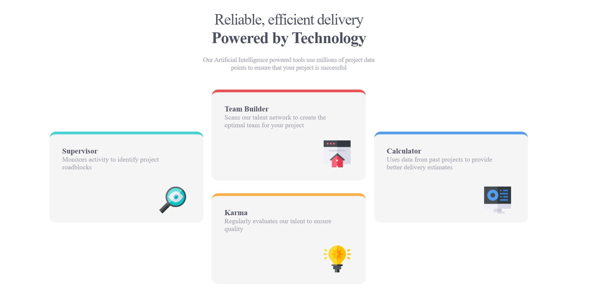

# Frontend Mentor - Four card feature section solution

## Welcome! 👋

Thank you for taking your time out to checking this front-end coding challenge.

[Frontend Mentor](https://www.frontendmentor.io) challenges help you improve your coding skills by building realistic projects.

This is a solution to the [Four card feature section challenge on Frontend Mentor](https://www.frontendmentor.io/challenges/four-card-feature-section-weK1eFYK). Frontend Mentor challenges help you improve your coding skills by building realistic projects. 

## Table of contents

- [Overview](#overview)
  - [The challenge](#the-challenge)
  - [Screenshot](#screenshot)
  - [Links](#links)
- [My process](#my-process)
  - [Built with](#built-with)
  - [What I learned](#what-i-learned)
  - [Continued development](#continued-development)
  - [Useful resources](#useful-resources)
- [Author](#author)

**Note: Delete this note and update the table of contents based on what sections you keep.**

## Overview

### The challenge

Users should be able to:

- View the optimal layout for the site depending on their device's screen size

### Screenshot

Add a screenshot of your solution. The easiest way to do this is to use Firefox to view your project, right-click the page and select "Take a Screenshot". You can choose either a full-height screenshot or a cropped one based on how long the page is. If it's very long, it might be best to crop it.

### Links

- Solution URL: [Add solution URL here](https://your-solution-url.com)
- Live Site URL: [Add live site URL here](https://your-live-site-url.com)

## My process

### Built with

- Semantic HTML5 markup
- CSS custom properties
- Flexbox

### What I learned

The position element together with its property of CSS of Absolute. Eelemnts that are relatively positioned remain in the normal flow. Another property that I used to confuse it with Absolute was "Fixed" property. This is normaly used when creating gloating elements. The "Sticky" property of position, can be thought of a hybrid of "Fixed" and "Relative"

### Continued development

CSS Grid is one of the other concepts of the css that i need to get myself familiar with. I think It have used quiet often, hence I want to learn and make the most out of it.
 

 ### Useful resources

 
 [CSS Tricks](https://css-tricks.com/snippets/css/a-guide-to-flexbox/#aa-flexbox-properties) - This site gave me an opportunity to dwell deep into the concepts of how to use the flexbox properties.
I really enjoyed the graphical explanations with detailed diagram and code snippets, that was cherry on-top.

- [MDN web docs](https://developer.mozilla.org/en-US/docs/Web/CSS/CSS_flexible_box_layout) - MDN is my go-to site that I most frequent when building a project, it provides a well laid-out and detailed explanations. 

## Author

- Website - [Keo Lamola](https://github.com/OekPhlesym)
- Frontend Mentor - [@OekPhlesym](https://www.frontendmentor.io/profile/OekPhlesym)
- Twitter - [@OekPhlesym](https://www.twitter.com/OekFlesym)

